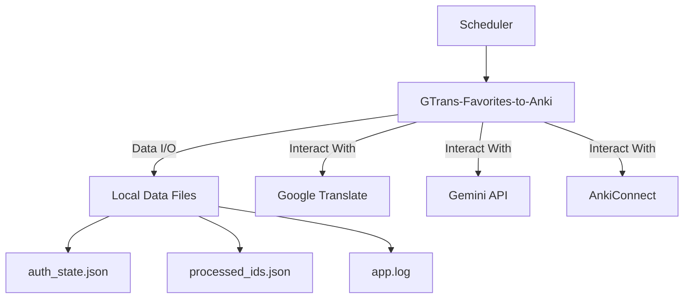

## Automated Anki Word & Sentence Learning System (GTrans-Favorites-to-Anki) Specification

### 1. System Overview

#### 1.1. System Name

**GTrans-Favorites-to-Anki** (Anki Vocab-Bot)

#### 1.2. Purpose

GTrans-Favorites-to-Anki automatically retrieves words and sentences saved in Google Translate's "Favorites" using a **Python script**. The retrieved data is processed by Gemini AI and automatically registered as cards in Anki. After successful registration, the corresponding items are deleted from Google Translate Favorites to prevent duplicate entries and maintain efficient learning. This system is designed to run directly on a local environment, offering a simple and automated learning solution.

### 2. System Architecture

This system runs directly as a Python script. Persistent data such as authentication information and logs are stored in the `data/` folder at the project root.

#### 2.1. Folder Structure

```
anki-vocab-bot/
├── requirements.txt         # Python library dependencies
├── .env                     # Manages API keys and sensitive information
│
├── src/                     # Python source code
│   ├── main.py              # Main processing script
│   ├── config.py            # Configuration loading script
│   └── selectors.json       # Web scraping CSS selectors
│
└── data/                    # Persistent data
    ├── auth_state.json      # Google login authentication information
    ├── processed_ids.json   # List of processed words/sentences
    └── app.log              # Execution logs
```

#### 2.2. Data Flow Diagram



### 3. Functional Requirements

#### 3.1. Authentication Feature

- **Initial Manual Login:** On the first execution, or if authentication information is missing, the script will launch in manual login mode. The user logs into their Google account in the launched browser and completes any 2-step verification.
- **Persistence of Authentication Information:** After login, authentication information (e.g., cookies) is saved locally as `data/auth_state.json`.
- **Automatic Login:** For subsequent executions, `data/auth_state.json` is read, and the login process is completely skipped.

#### 3.2. Data Acquisition Feature

- **Web Scraping:** Playwright is used to access the Google Translate Favorites page in headless mode.
- **Externalization of Selectors:** All CSS selectors for identifying HTML elements are defined in `src/selectors.json`. If the site structure changes, only this file needs to be modified.
- **Prevention of Duplicate Processing:** Information about processed words and sentences is recorded in `data/processed_ids.json` to exclude them from future processing.

#### 3.3. Data Processing Feature (Gemini)

- **Secure API Key Management:** The Gemini API key is written in the `.env` file and loaded as an environment variable by the script. The key is never hardcoded in the script.
- **Data Processing:** The extracted words and sentences are processed using the Gemini API for tasks such as part-of-speech tagging and example sentence generation.

#### 3.4. Data Registration Feature (Anki)

- **AnkiConnect Integration:** The system connects to AnkiConnect (`http://localhost:8765`) running on the host PC.
- **Card Registration:** Processed data is formatted into Anki card format and registered to the specified decks.

#### 3.5. Favorite Item Deletion Feature

- After successful card registration to Anki, the corresponding words and sentences are automatically deleted from the Google Translate Favorites page.

#### 3.6. Logging Feature

- System execution status, number of retrieved data items, error information, etc., are recorded in `data/app.log`.

### 4. Technology Stack

| Category               | Technology                                                       | Notes                                      |
| :--------------------- | :--------------------------------------------------------------- | :----------------------------------------- |
| **Language**           | Python 3.9+                                                      |                                            |
| **Browser Automation** | Playwright                                                       | Robust browser operation & auth management |
| **AI Model**           | Google Gemini API                                                | Data processing                            |
| **Anki Integration**   | AnkiConnect                                                      | Card registration via add-on               |
| **Libraries**          | `playwright`, `requests`, `python-dotenv`, `google-generativeai` | Managed by `requirements.txt`              |

### 5. Execution Steps

#### 5.1. Initial Setup

1.  Clone or download the project.
2.  **Install necessary dependencies.**
    ```bash
    pip3 install -r requirements.txt
    ```
3.  **Download browsers for Playwright.**
    ```bash
    python3 -m playwright install
    ```
4.  Create a `.env` file and add your `GEMINI_API_KEY`, etc.
    - Refer to `docs/env.example` for a sample (save the same content as `.env` in the project root).
    - If you customize your Anki deck names and note types, add the following to your `.env` file:
      ```dotenv
      ANKI_WORD_DECK_NAME="Your Word Deck Name"
      ANKI_SENTENCE_DECK_NAME="Your Sentence Deck Name"
      ANKI_WORD_NOTE_TYPE="Your Word Note Type Name"
      ANKI_SENTENCE_NOTE_TYPE="Your Sentence Note Type Name"
      ```
5.  Launch Anki and enable the AnkiConnect add-on.
6.  **Perform manual login. A browser will launch; please log into your Google account.**
    ```bash
    python3 -m src.main --manual-login
    ```
    Once you have logged in and the Google Translate Favorites page is displayed, return to the terminal and press `Enter`.
    Upon success, `data/auth_state.json` will be generated.

#### 5.2. Automated Execution

- Register the following command to run at specified times in your host PC's task scheduler (Windows) or cron (Mac/Linux).

  ```bash
  cd /path/to/anki-vocab-bot && python3 -m src.main --once
  ```

  ### 5.2.1. Using `anki_scheduler.sh` (Recommended for Mac)

  For Mac users, `anki_scheduler.sh` is provided to automate the process more robustly. This script ensures Anki is launched before the Python script runs and then quits Anki after processing. This is ideal for scheduling with `cron`.

  **Setup `anki_scheduler.sh`:**

  1.  **Make the script executable:**
      ```bash
      chmod +x anki_scheduler.sh
      ```
  2.  **Edit the script (if necessary):**
      Open `anki_scheduler.sh` and ensure the `python3` path is correct. You can find the correct path using `which python3`.
      ```bash
      # Example: If 'which python3' returns /usr/local/bin/python3, update the script accordingly.
      /usr/bin/python3 -m src.main --once
      ```

  **Mac (cron) Scheduling Example (Run every 2 hours using `anki_scheduler.sh`)**

  1.  Open Terminal.
  2.  Open the `crontab` editor.
      ```bash
      crontab -e
      ```
  3.  When the editor opens, add the following line to the end of the file.
      ```cron
      0 */2 * * * /path/to/your/anki-vocab-bot/anki_scheduler.sh >> /path/to/your/anki-vocab-bot/data/anki_cron.log 2>&1
      ```
      **Note:**
      - `/path/to/your/anki-vocab-bot` should be replaced with the **absolute path** to your project.
      - `/path/to/your/anki-vocab-bot/data/anki_cron.log` should be replaced with the **absolute path** to your log file.
  4.  Save the file and exit the editor (Nano: `Ctrl + O`, `Enter`, `Ctrl + X` / Vim: `:wq`, `Enter`).

  ---

  **Mac (cron) Scheduling Example (Run every 2 hours)**

  1.  Open Terminal.
  2.  Open the `crontab` editor.
      ```bash
      crontab -e
      ```
  3.  When the editor opens, add the following line to the end of the file.
      ```cron
      0 */2 * * * cd /path/to/your/anki-vocab-bot && /usr/bin/env python3 -m src.main --once >> /path/to/your/anki-vocab-bot/data/cron.log 2>&1
      ```
      **Note:**
      - `/path/to/your/anki-vocab-bot` should be replaced with the **absolute path** to your project.
      - `/usr/bin/env python3` is the path to `python3`. If you encounter issues, use `which python3` to find the exact path and replace it.
      - `/path/to/your/anki-vocab-bot/data/cron.log` should be replaced with the **absolute path** to your log file.
  4.  Save the file and exit the editor (Nano: `Ctrl + O`, `Enter`, `Ctrl + X` / Vim: `:wq`, `Enter`).

  **Important Considerations for Cron:**

s - `cron` runs without a GUI environment, so ensure Playwright runs in headless mode (`PLAYWRIGHT_HEADLESS=true`).

- If `auth_state.json` expires, the script will fail. You will need to manually run `python3 -m src.main --manual-login` again to update the authentication state.
- Periodically check `data/cron.log` to confirm the script is running without errors.

### 6. CLI Options

- `--manual-login`: Executes the manual login flow to generate/update `data/auth_state.json`.
- `--once`: Processes one batch and exits.
- `--limit <N>`: Maximum number of items to process in one run (default is `BATCH_LIMIT` environment variable or 50).
- `--dry-run`: Logs planned processing without sending data to AnkiConnect.
- `--skip-browser`: Skips browser operations via Playwright (for development/debugging).

### 7. Maintenance

- If Google Translate's site structure changes and scraping fails, investigate new CSS selectors using browser developer tools and update `src/selectors.json`. Python code changes are generally not required.

### 8. Considerations

- **Anki Running:** This system assumes that the Anki application is running on the host PC when the script is executed.
- **Authentication Expiration:** Google login sessions have an expiration date. If automated login starts failing, you will need to perform manual login again to update `auth_state.json`.
- **Prompt Engineering:** The Gemini prompt may need continuous improvement to achieve optimal results from Gemini.
